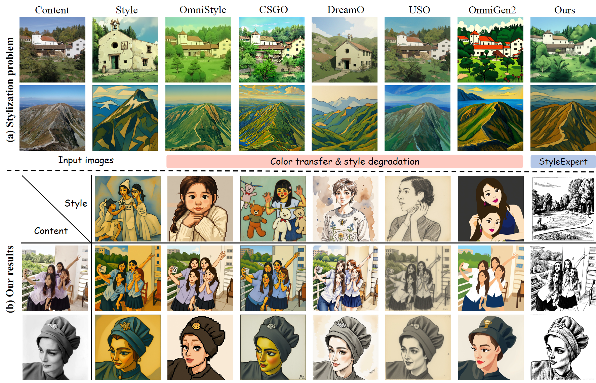
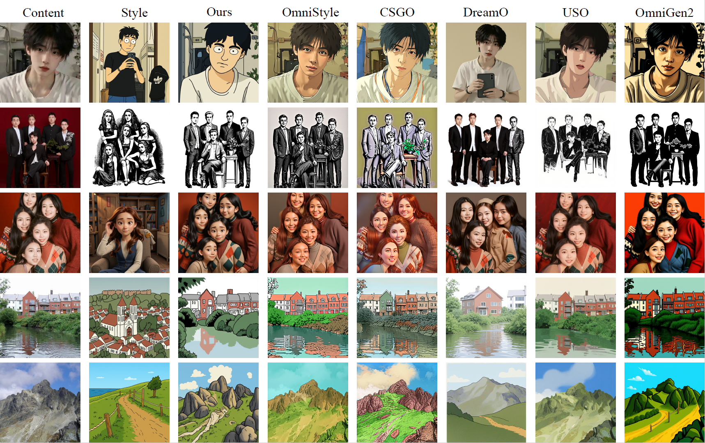

# StyleExpert-jittor

> Mixture of Style Experts for Diverse Image Stylization — Jittor 推理迁移版。

本仓库以 [HVision-NKU/StyleExpert](https://github.com/HVision-NKU/StyleExpert) 官方实现（提交 `56a2759`）为代码基线，并将执行后端替换为 **Jittor + JTorch**。官方最新的 MoE 推理流程、16 专家配置、模型下载路径、命令行参数与 Gradio 入口均已同步；仅在后端接入处做 Jittor 兼容修改。

## 展示





以上图片来自 [官方仓库的 `assets/figures`](https://github.com/HVision-NKU/StyleExpert/tree/main/assets/figures)，用于展示论文中的官方结果，**不是 Jittor 后端的重新出图或数值等价性证明**。

## 与官方实现的对应关系

| 项目 | 官方 StyleExpert | 本仓库 |
| --- | --- | --- |
| 推理逻辑和 `src/` 模块 | 当前官方主线 | 同步官方主线 |
| MoE 默认专家数 | 16 | 16 |
| 配置与权重目录 | `configs/config_moe.yaml`、`weights/` | 相同 |
| 后端 | PyTorch | Jittor + JTorch 兼容层 |
| CUDA 精度 | `bfloat16` 与 PyTorch 专用优化 | `float16`；Jittor 选择可用算子 |
| 注意力 | PyTorch SDPA / `_native_flash` | Jittor 算子；缺失时使用 SDPA 兼容实现 |

未保留官方主线之外的旧版 LoRA 配置入口；请使用 `config_moe.yaml` 与 `HH-LG/StyleExpert` 发布的 16-expert 权重。

## 安装

推荐 Linux/WSL、Python 3.10、NVIDIA GPU：

```bash
conda create -n styleexpert-jittor python=3.10 -y
conda activate styleexpert-jittor
cd StyleExpert-jittor
python install.py
```

`install.py` 会安装 Jittor 与 JTorch；请不要在同一环境中预装原生 PyTorch。可用下面的命令确认后端：

```bash
python -c "from jittor_runtime import jt, torch; print(jt.__version__, jt.flags.use_cuda, torch.Tensor)"
```

## 模型下载

请先在 Hugging Face 接受 `black-forest-labs/FLUX.1-Kontext-dev` 的许可证，再执行：

```bash
python download_models.py --token YOUR_HF_TOKEN
```

脚本沿用官方固定目录：

```text
weights/                              # HH-LG/StyleExpert 的适配器
models/FLUX.1-Kontext-dev/            # FLUX 基座
models/siglip-so400m-patch14-384/     # SigLIP
```

## 推理

```bash
python infer.py \
  --content_path ./assets/examples/content_00.png \
  --style_path ./assets/examples/style_00.png \
  --output_path ./outputs/example_00_out.png \
  --seed 42
```

也可传入官方支持的提示词覆盖：

```bash
python infer.py --content_path content.png --style_path style.png --prompt "Generate an image using the object from IMG1 in the style of IMG2"
```

启动 Gradio：

```bash
python app.py
```

`--cpu` 仅用于验证入口，完整 FLUX 推理需要 GPU：

```bash
python infer.py --cpu --content_path content.png --style_path style.png
```

## 验证

```bash
python -m pytest tests/test_port_structure.py
```

该测试覆盖代码语法、官方主线的 16-expert 配置、Jittor 运行时优先加载和关键兼容层。完整出图验证仍需要下载全部模型并在可用的 CUDA Jittor 环境执行。

## 致谢与许可

本项目迁移自 [StyleExpert](https://github.com/HVision-NKU/StyleExpert)，并参考 [NK-JittorCV/nk-diffusion](https://github.com/NK-JittorCV/nk-diffusion) 的 Jittor/JTorch 接入思路。沿用原项目 [CC BY-NC 4.0](https://creativecommons.org/licenses/by-nc/4.0/) 非商业使用许可。

```bibtex
@misc{zhu2026mixturestyleexpertsdiverse,
  title={Mixture of Style Experts for Diverse Image Stylization},
  author={Shihao Zhu and Ziheng Ouyang and Yijia Kang and Qilong Wang and Mi Zhou and Bo Li and Ming-Ming Cheng and Qibin Hou},
  year={2026},
  eprint={2603.16649},
  archivePrefix={arXiv},
  primaryClass={cs.CV}
}
```
